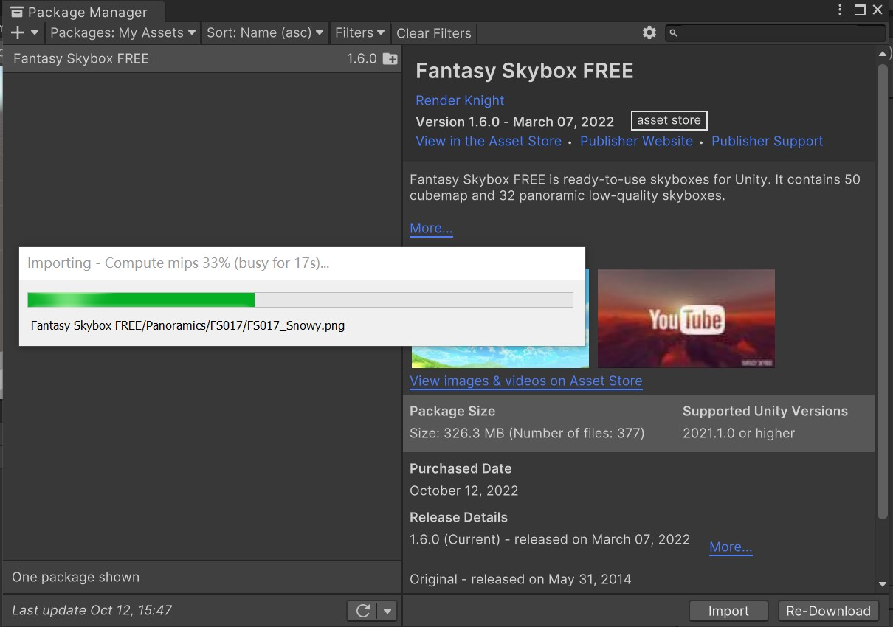
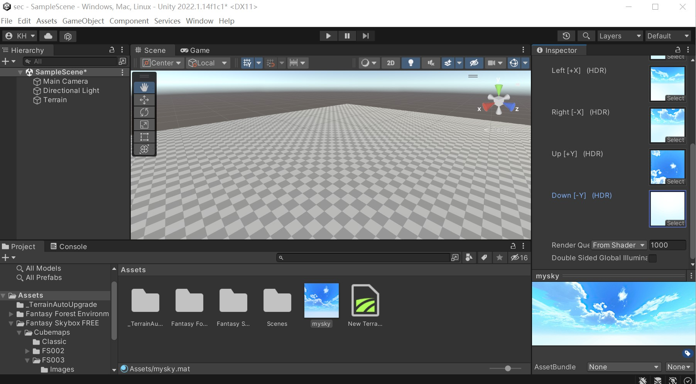
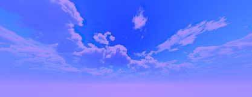
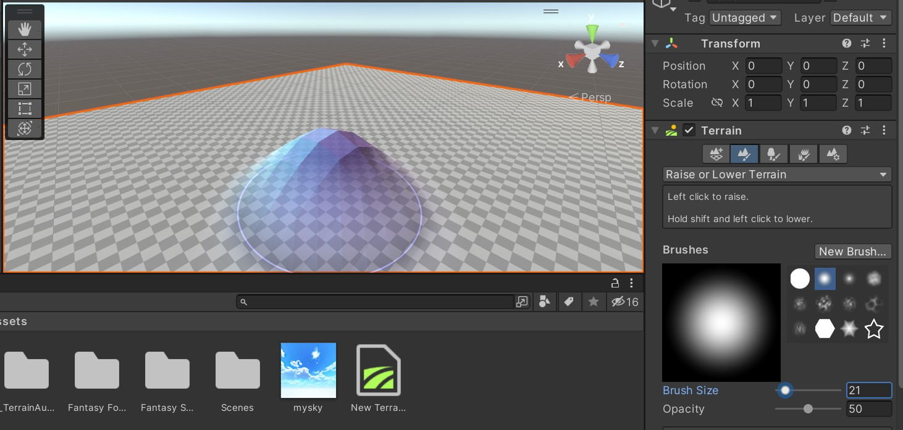
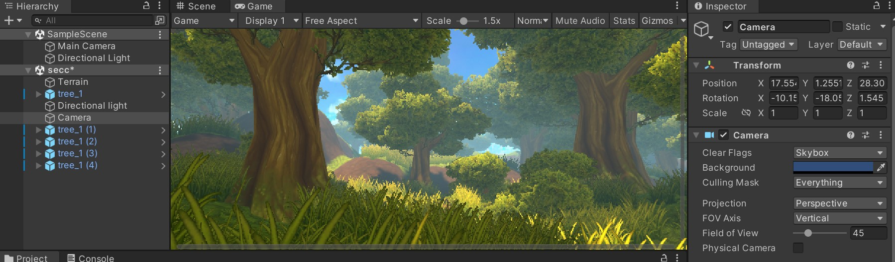
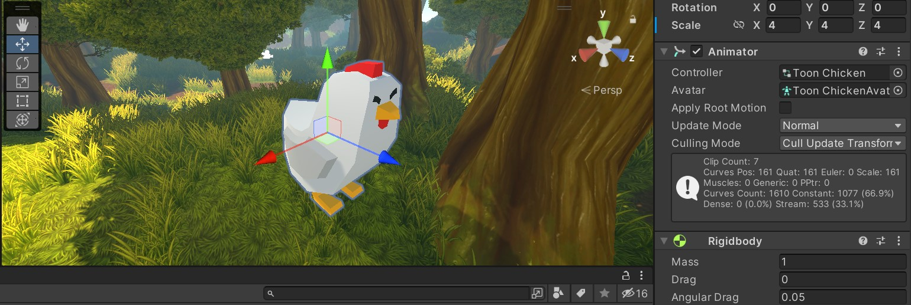

# 游戏场景

下载 Fantasy Skybox FREE，构建自己的游戏场景，并为场景设计地
形（含树木和草地等元素）

### 从asset store中下载素材

打开unity-window-asset store，搜索fantasy skybox free，下载并导入项目

### 创建天空盒

在assets中创建一个material，命名为mySky，将它的Shader改为Skybox/6 Sided，在Fantasy Skybox中找到对应front,back,left,right,up,down六张图导入

可以通过改变Tint Color来改变天空颜色

改变Exposure来调整天空的曝光度，形成夜晚的天空

### 创建地形

在Hierarchy窗口创建一个Terrain对象，然后在Terrain的Inspector窗口中对其进行修改

调整刷子大小形状来创建凹凸不平的地表，使用不同草树素材来种树丰富地貌

### 整合场景

在camera中添加一个component-rendering-skybox，加入自制天空盒mysky

除了天空草地还可以在画面中加入角色，给gameobject添加rigidbody组件，一个物体有了刚体，它就会受Unity模拟出的自然界中的力的影响了

